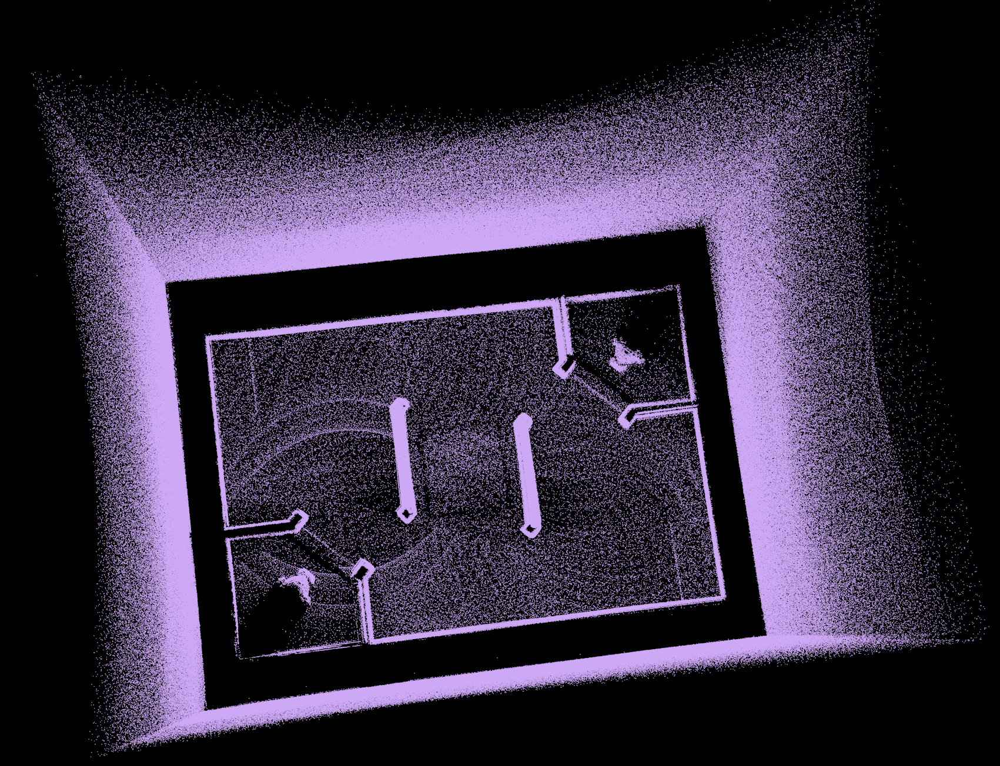
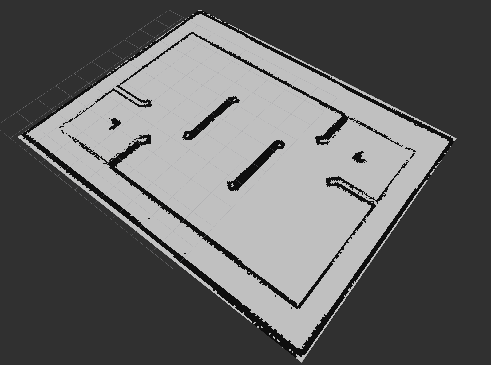

# PCD2PGM

基于 ROS2 和 PCL 库，用于将 `.pcd` 点云文件转换为用于 Navigation 的 `pgm` 栅格地图

|pcd|pgm|
|:-:|:-:|
|||

## 一. 功能

- 读取指定的`.pcd`文件

- 使用Pass Through滤波器过滤点云

- 使用Radius Outlier滤波器进一步处理点云

- 将处理后的点云转换为占据栅格地图（Occupancy Grid Map）

- 将转换后的地图发布到指定ROS话题上

## 二. 使用指南

### 2.1 克隆仓库

  ```sh
  git clone https://gitee.com/LihanChen2004/pcd2pgm.git
  ```

### 2.2 安装依赖

[ROS2 Humble](https://docs.ros.org/en/humble/Installation.html)（尚未在其他 ROS 版本中测试）

```sh
rosdep install -r --from-paths src --ignore-src --rosdistro $ROS_DISTRO -y
```

### 2.3 编译

```sh
cd /path/to/your/ros2_ws/
colcon build --symlink-install
```

### 2.4 运行 PCD2PGM 节点

```sh
source install/setup.sh
ros2 launch pcd2pgm pcd2pgm.launch.py
```

### 2.5 保存栅格地图

```sh
ros2 run nav2_map_server map_saver_cli -f YOUR_MAP_NAME
```

## 三. 参数说明

可以通过修改`pcd2pgm/pcd.yaml`文件来配置节点的参数。

  ```yaml
  /pcd2pgm:
    ros__parameters:
      file_directory: /home/lihanchen/Downloads/pcd2pgm/  # PCD文件所在目录
      file_name: RMUC  # PCD文件名（不包含后缀）
      flag_pass_through: false  # 是否使用Pass Through滤波器
      map_resolution: 0.05  # 地图分辨率
      map_topic_name: map  # 发布地图的ROS话题名
      thre_radius: 0.5  # Radius Outlier滤波器半径
      thre_z_max: 2.0  # Z轴最大值（用于Pass Through滤波器）
      thre_z_min: 0.1  # Z轴最小值（用于Pass Through滤波器）
      thres_point_count: 10  # 最小点数阈值（用于Radius Outlier滤波器）
      use_sim_time: false  # 是否使用仿真时间
  ```
